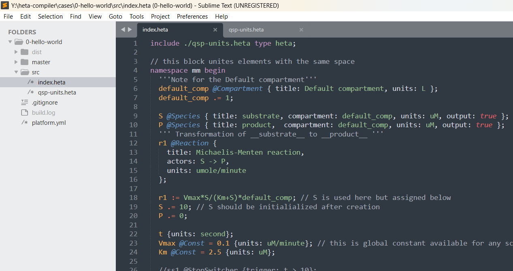

# Heta Highlight

Plugin for Sublime text editor to highlight Heta language code.

This is the derivative from [heta-highlight-vscode package](https://github.com/hetalang/heta-highlight-vscode).

This is part of [Heta project](https://hetalang.github.io/#).

## Installation

First of all you need to [install Package Control](https://packagecontrol.io/installation), then find and choose `Heta` from the `Package Control: Install Package` dropdown list in the Command Palette.

## Case

## License

[MIT](LICENSE)
